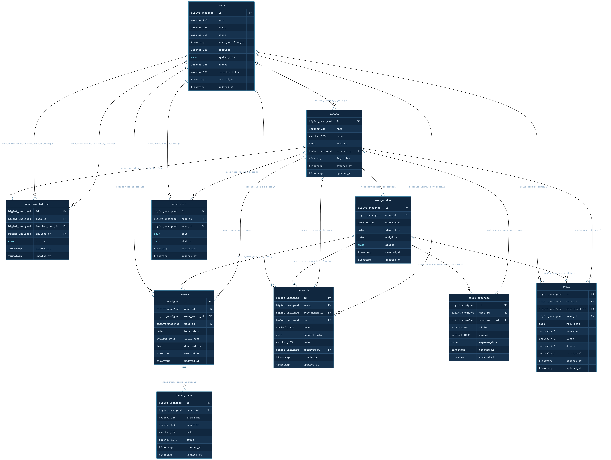
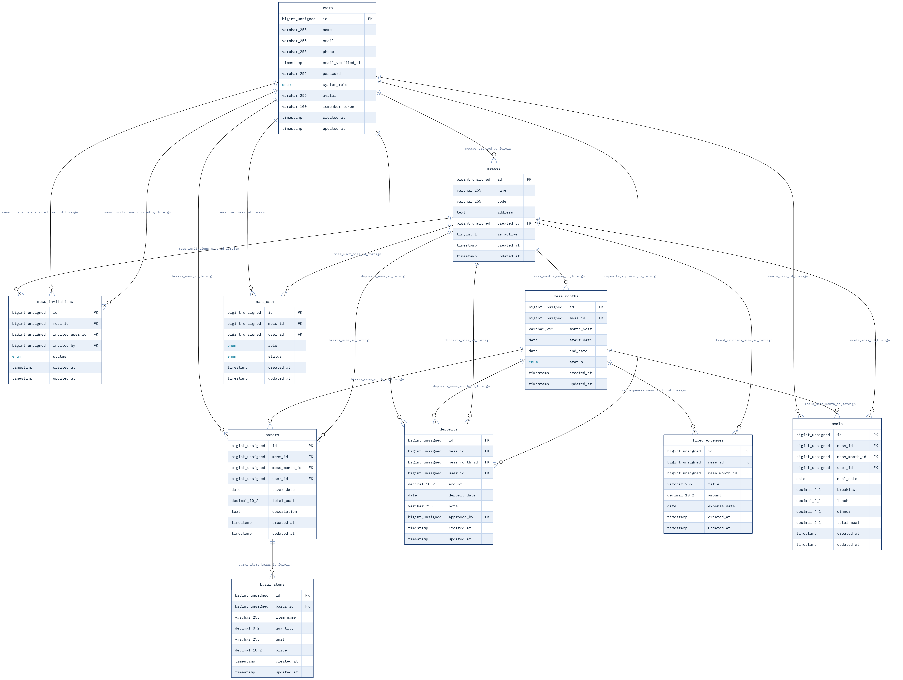

# Laravel Truss - Database Schema Visualizer

An interactive Database Schema Visualizer and Entity-Relationship Diagram (ERD) tool for Laravel applications. This project leverages the `albertoarena/laravel-truss` package to render a clear, visual overview of database tables, model relationships, indices, and foreign key constraints directly in your browser.

---

## Visual Overview

Here is a preview of the database visualizer generated by Laravel Truss:

<p align="center">
  
</p>

<p align="center">
  
</p>

---

## Key Features

- **Interactive ERD Explorer**: Browse database tables, view primary/foreign keys, and examine data types visually.
- **Model Relationship Mapping**: Automatically detects and maps Eloquent model relationships (`hasMany`, `belongsTo`, `belongsToMany`, etc.).
- **Schema & Index Inspection**: Easily inspect table indexes, unique constraints, and database structure without opening third-party database GUI applications.
- **Modern Laravel Integration**: Fully configured for modern Laravel applications and MySQL 8+.

---

## Prerequisites

Truss requires the following minimum environment setup:

- **PHP**: `8.3` or higher
- **Laravel**: `12.0` or higher
- **Composer**: `^2.x`
- **Database**: MySQL / MariaDB / PostgreSQL

---

## Installation and Setup

### 1. Clone the Repository

Clone this project from GitHub:

```bash
git clone [https://github.com/hassanroki/truss.git](https://github.com/hassanroki/truss.git)
cd truss
```
